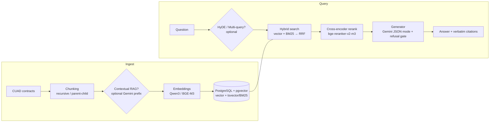

# ⚖️ Legal RAG — Contract Question-Answering with Citations

A production-style **Retrieval-Augmented Generation** system for legal contracts. Ask a question about a contract and get a grounded answer with **verbatim citations** — or an explicit refusal when the contract has no answer.

Built end-to-end on the [CUAD](https://www.atticusprojectai.org/cuad) contract-understanding dataset: hybrid retrieval, cross-encoder reranking, structured-output generation with a hard refusal gate, and a **full evaluation harness** that tracks both the retrieval layer and the generation layer.

<p>
  
  
  
  
  
</p>

---

## Demo

<!-- TODO: run `uv run scripts/serve.py`, open http://127.0.0.1:6800/ui, and replace the line below
     with one or two screenshots, e.g.:
     
     A short GIF of a streamed answer + citations is even better. -->

> _Screenshot of the Gradio chat UI goes here — ask a question, get a grounded answer with verbatim citations._

---

## Why this project is interesting

Most RAG demos stop at "embed → retrieve → prompt". This one is built like an engineering deliverable:

- **Hybrid retrieval** — dense vectors **+** PostgreSQL BM25, fused with Reciprocal Rank Fusion (RRF), then re-ranked by a cross-encoder.
- **Hallucination control** — the generator runs in **JSON mode** and must emit `{"refused": bool, "answer": str}`. Refusal is a first-class signal, not a string match — critical for a legal use case where a confident wrong answer is worse than "I don't know".
- **A real evaluation harness** — separate metrics for retrieval (`hit@k`, `mrr@k`, `precision/recall`) and generation (semantic-hit rate, false-refusal / false-answer rates, and LLM-as-judge faithfulness & answer-relevancy). Every config change is tracked as a versioned run with before/after numbers.
- **An advanced-technique playground** — Contextual RAG, HyDE, multi-query expansion, parent-child chunking, and **agentic query rewriting** are all implemented and individually toggleable, so each can be measured against the baseline.
- **An independent OCR pipeline** — scanned contracts → Markdown via MinerU, benchmarked on OmniDocBench (CER 7.35%), ready to feed the RAG ingest path.

---

## Architecture



**Serving:** a single process exposes both a **REST API** (`POST /query`, with SSE streaming and an optional agentic mode) and a **Gradio chat UI** (`/ui`), mounted together via `gr.mount_gradio_app()` so they share one `VectorStore` connection.

---

## Results

> Dataset: CUAD. Embedding dim 1024. All numbers are reproducible via the `scripts/eval*.py` harness; runs are timestamped under `data/runs/`.

### Retrieval layer

Best configuration — `chunks_qwen3` table, Qwen3-Embedding-0.6B, recursive chunks (1000 chars / 100 overlap), **hybrid (vector + BM25 RRF)**, reranked with `bge-reranker-v2-m3` (top-k 60):

| Metric | Value |
|--------|-------|
| **hit@1** | **0.580** |
| **mrr@5** | **0.667** |
| hit@5 | 0.804 |
| hit@10 | 0.890 |

> A recall-first profile (due-diligence / compliance review) instead uses Contextual-RAG embeddings (BGE-M3) and reaches **hit@5 = 0.833**. The two profiles are a deliberate precision-vs-recall trade-off, not a single "best" number.

### Generation layer — iteration history

The harness made each change measurable. Headline metric is **semantic-hit rate** (answer vs. gold answer, embedding cosine ≥ 0.70 — fairer than string containment):

| Version | semantic-hit | false-refusal ↓ | faithfulness ↑ | answer-relevancy ↑ |
|---------|:---:|:---:|:---:|:---:|
| v1 baseline | 0.680 | 0.120 | 0.667 | 0.867 |
| v2 (few-shot, k=10) | 0.740 | **0.040** | 0.500 | 0.967 |
| v3 (verbatim-quote constraint) | 0.760 | 0.100 | 0.667 | 0.867 |
| **v4 (current best)** | **0.820** | **0.040** | **0.667** | **0.967** |

**v4** = Gemini JSON mode + verbatim-quote constraint + few-shot + `doc_meta` injection (with the RAGAS judge given the same `doc_meta` context) + reranker, `top_k=10`, `generate_k=8`, avg latency ~756 ms.

> A debugging highlight: an earlier `doc_meta` experiment *looked* like it hurt faithfulness. Root cause wasn't the model — the RAGAS judge wasn't being shown `doc_meta`, so metadata-sourced answers were scored as hallucinations. Feeding the judge the same context removed the measurement bias and unlocked the v4 jump. (See `CLAUDE.md` for the full run log.)

### OCR layer (independent)

MinerU `hybrid-auto-engine` on **OmniDocBench** (1615 samples):

| | CER | WER |
|--|:---:|:---:|
| **Overall** | **7.35%** | **9.22%** |
| academic_literature | 11.02% | 12.24% |
| book | 13.51% | 15.77% |
| research_report | 27.24% | 39.96% |

> `research_report`'s gap is a **multi-column reading-order** problem (WER ≫ CER), not character recognition — a useful diagnostic the metric split makes visible.

---

## Tech stack

| Layer | Choice |
|-------|--------|
| Language / tooling | Python 3.11+, [`uv`](https://github.com/astral-sh/uv), `ruff` |
| Vector store | PostgreSQL + **pgvector** (dense) + **tsvector** (BM25 full-text) |
| Embeddings | Qwen3-Embedding-0.6B / BAAI/bge-m3 via OpenAI-compatible API |
| Reranker | BAAI/bge-reranker-v2-m3 (TEI `/v1/rerank`) |
| Generation & judging | Google Gemini (JSON mode for generation; LLM-as-judge for eval) |
| Serving | FastAPI (async, SSE) + Gradio, single process |
| OCR | MinerU (`hybrid-auto-engine`), benchmarked on OmniDocBench |
| Data | CUAD (HuggingFace `theatticusproject/cuad`) |

---

## Quickstart

### Prerequisites

1. **PostgreSQL with the `pgvector` extension** (`CREATE EXTENSION vector;`). Schema and indexes are created automatically on first ingest.
2. **An embedding + reranker endpoint** exposing an OpenAI-compatible API at `http://127.0.0.1:6006` (e.g. a local or remote GPU running the models above). For a remote GPU, set `provider: ssh_tunnel` in `config.yaml` and the app opens the port-forward for you.
3. **A Gemini API key** (used for generation, and for the optional Contextual-RAG / HyDE / agentic features).

### Install

```bash
uv pip install -e .
```

### Configure

Copy `.env.example` → `.env` and fill in:

```env
EMBED_API_KEY=...     # embedding service auth
PG_PASSWORD=...       # PostgreSQL password
GEMINI_API_KEY=...    # generation + optional Gemini-based features
```

All runtime parameters live in **`config.yaml`**. CLI flags (`--overlap`, `--table`, `--reranker`, …) override the YAML **at runtime without editing the file**.

### Ingest & serve

```bash
# 1. Chunk, embed and store the corpus (CUAD is fetched from HuggingFace on first run)
uv run scripts/ingest.py

# 2. Launch the API + Gradio UI
uv run scripts/serve.py            # http://127.0.0.1:6800/ui
uv run scripts/serve.py --no-ui    # REST API only
```

### Query the API

```bash
curl -s http://127.0.0.1:6800/query \
  -H "Content-Type: application/json" \
  -d '{"question": "What is the governing law of this contract?",
       "doc_id": null,
       "top_k": 10,
       "generate_k": 8,
       "agentic": false}'
```

```jsonc
{
  "question": "What is the governing law of this contract?",
  "answer": "This Agreement is governed by the laws of the State of California...",
  "refused": false,
  "citations": [
    {"doc_id": "...", "chunk_id": "...", "start": 1843, "end": 1971, "excerpt": "..."}
  ],
  "latency_ms": 752.0
}
```

Set `"stream": true` for token-by-token SSE, or `"agentic": true` to enable iterative query-rewriting when the first retrieval returns nothing.

### CLI

```bash
legal-rag ingest --docs-dir data/cuad_docs
legal-rag query  --question "What is the term of this agreement?" --k 5
legal-rag eval   --qa-file data/qa_cuad.jsonl --output data/runs/eval.json
```

### Reproduce the evaluations

```bash
uv run scripts/eval.py --reranker                              # retrieval metrics
uv run scripts/eval_generation.py --limit 200 --reranker \
    --sim-threshold 0.70 --ragas --ragas-limit 30              # generation metrics + RAGAS
uv run scripts/grid_search.py --reranker                       # hyperparameter sweep
```

---

## Configuration highlights (`config.yaml`)

Every retrieval/generation strategy is a toggle, which is what makes the ablation studies possible:

```yaml
retrieval:   { mode: hybrid, top_k: 10, rerank_top_k: 60 }   # vector | bm25 | hybrid
reranker:    { enabled: false, model: BAAI/bge-reranker-v2-m3 }
contextual:  { enabled: false, model: gemini-3.1-flash-lite } # Contextual RAG
hyde:        { enabled: false }                               # hypothetical-document embeddings
multi_query: { enabled: false, n: 3 }                         # query expansion + RRF
parent_child:{ parent_chars: 1000, child_chars: 300 }         # small-to-big retrieval
```

---

## Project structure

```
lex-rag/
├── lex_rag/                 # core package (~2.3k LOC)
│   ├── pipeline.py          # the single orchestrator: ingest + query paths
│   ├── store.py             # pgvector + BM25 store, dynamic table names, auto-schema
│   ├── chunking.py          # recursive & parent-child chunkers
│   ├── embeddings.py        # OpenAI-compatible client with on-disk cache
│   ├── reranker.py          # cross-encoder rerank client
│   ├── contextualizer.py    # Contextual RAG / HyDE / multi-query / metadata extraction
│   ├── generator.py         # Gemini JSON-mode generator with refusal gate + citations
│   ├── agent.py             # agentic iterative-retrieval wrapper
│   ├── evals.py             # retrieval metric computation
│   └── config.py            # dataclass config, YAML + .env loader
├── scripts/                 # ingest / serve / eval / grid-search / OCR entrypoints
├── docs/                    # baseline.md, bug_fixes.md
├── config.yaml              # all runtime parameters
└── CLAUDE.md                # detailed engineering log & full run history
```

---

## Design decisions worth calling out

- **Refusal as a structured field, not a heuristic.** Gemini JSON mode returns `{"refused": bool, ...}`, eliminating the "soft refusal" ambiguity where a model hedges in prose. The eval harness then measures false-refusal and false-answer rates directly.
- **BM25 inside PostgreSQL.** Full-text search uses a `GENERATED` `tsvector` column, so dense and sparse retrieval hit the same store with one connection — no separate search engine to operate. (A subtle CUAD-template bug that broke BM25 OR-semantics is documented in `docs/bug_fixes.md`.)
- **Config-driven ablations.** Scripts override config via `dataclasses.replace()` at runtime rather than mutating files, so a grid search can fan out across parameter combinations without side effects.
- **Provenance tracking.** An `ingest_meta` table records the actual chunking parameters used for each table, so the evaluator reads real ingest settings instead of trusting the current YAML.
- **Lazy, optional heavy deps.** Gemini (`from google import genai`) is imported inside constructors — toggling a feature off means its dependency is never touched.

---

## Roadmap

Honest next steps to take this from "strong portfolio project" to "deployable service":

- [ ] Unit tests (`pytest`) for the pure logic — RRF fusion, chunk-span matching, chunkers — none require external services.
- [ ] `docker-compose` (Postgres + pgvector) for one-command reproducibility.
- [ ] CI (GitHub Actions: `ruff` + `pytest`).
- [ ] Wire the OCR pipeline's output directly into the RAG ingest path end-to-end.
- [ ] API auth / rate-limiting / structured request logging.

---

## Acknowledgements

- **CUAD** — The Atticus Project, contract-understanding dataset.
- **OmniDocBench** — OpenDataLab, OCR benchmark.
- **MinerU** — document-parsing engine used for the OCR layer.
